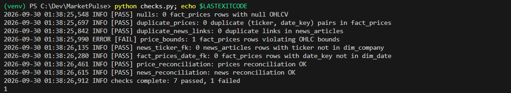
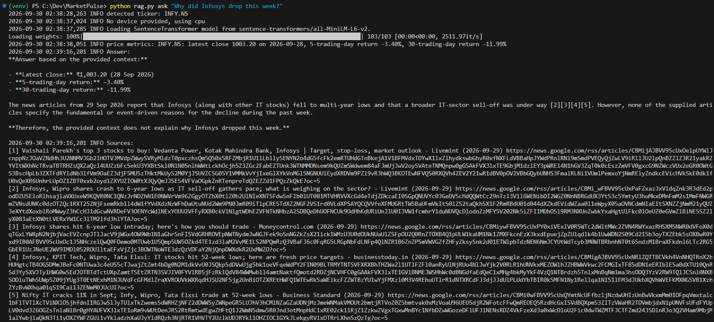

# MarketPulse

MarketPulse is a daily data pipeline for 20 NSE-listed stocks. It pulls one year of daily prices from yfinance and recent headlines from Google News RSS and saves both as Parquet. It then loads them into a PostgreSQL star schema on Supabase with idempotent upserts. Before anything downstream uses the data, it runs quality and reconciliation checks. On top of the data sits a small RAG layer: a question is embedded and matched against stored news embeddings (pgvector), combined with price metrics computed in SQL, and answered by an LLM through OpenRouter, with numbered sources.

## Architecture

```
 companies.csv ─┐
 yfinance ──────┼─> ingest/prices.py ─> data/raw/prices.parquet ─┐
 Google News RSS ──> ingest/news.py ──> data/raw/news.parquet ───┤
                                                                  v
                                   load.py  (ON CONFLICT upserts, daily_return in SQL)
                                                                  v
                          Supabase PostgreSQL: star schema + pgvector
                                                                  v
                          checks.py  (8 checks, logs to pipeline_runs, exit 1 on failure)
                                                                  v
                          rag.py index  (embed each article -> news_chunks)
                                                                  v
 question ─> rag.py ask ─> embed ─> vector search (+ ticker filter)
                                  + SQL price metrics ─> LLM (OpenRouter) ─> answer + sources
```

`run_pipeline.py` runs ingest prices, ingest news, load, checks and RAG index in that order. It stops at the first failed step.

## Tech stack

- Python 3.11+, pandas, pyarrow
- yfinance (prices), feedparser (Google News RSS)
- Supabase PostgreSQL with the pgvector extension, accessed with psycopg2
- sentence-transformers `all-MiniLM-L6-v2` (384-dim embeddings, normalized)
- OpenRouter chat completions API via `requests`: the model is set in `.env`, with an optional fallback model
- python-dotenv for configuration and the `logging` module for all output

## Setup (Windows)

1. Create and activate a virtual environment:
   ```
   python -m venv venv
   venv\Scripts\activate
   ```
2. Install dependencies:
   ```
   pip install -r requirements.txt
   ```
3. Copy `.env.example` to `.env` and fill in the values:
   ```
   copy .env.example .env
   ```
   - `DATABASE_URL`: the Supabase **Session pooler** connection URI
   - `OPENROUTER_API_KEY`: your OpenRouter key
   - `LLM_MODEL`: an OpenRouter model id
   - `LLM_FALLBACK_MODEL`: optional, a second model to use if the first one fails
4. In the Supabase SQL editor, run `sql/schema.sql`. It enables pgvector and creates all tables.
5. Run the pipeline:
   ```
   python run_pipeline.py
   ```
6. Ask a question:
   ```
   python rag.py ask "What is the latest news on TCS?"
   ```

## Star schema

| Table | Type | Contents |
|---|---|---|
| `dim_company` | dimension | `ticker` (PK), `name`, `sector`, from `data/reference/companies.csv` |
| `dim_date` | dimension | `date_key` (PK), `year`, `month`, `quarter`, `weekday` |
| `fact_prices` | fact | one row per `(ticker, date_key)`: OHLC, volume, and `daily_return` computed in SQL with `LAG(close)` |
| `news_articles` | supporting | headline, summary, `link` (unique), `published`, `source`, `ticker` |
| `news_chunks` | supporting | one embedded chunk per article: `chunk_text`, `embedding vector(384)` |
| `pipeline_runs` | audit | one row per load step, checks run, RAG index and full pipeline run |

Every load uses `ON CONFLICT`: prices and companies are upserted, while dates and news are inserted only if new. Re-running the pipeline never creates duplicate rows.

## Data quality

`checks.py` runs 8 checks against the loaded data:

1. **nulls:** no null OHLCV values in `fact_prices`
2. **duplicate_prices:** no duplicate `(ticker, date_key)` pairs
3. **duplicate_news_links:** no duplicate article links
4. **price_bounds:** `low <= open`, `low <= close`, `close <= high`, `open <= high`, all prices > 0
5. **news_ticker_fk:** every article's ticker exists in `dim_company`
6. **fact_prices_date_fk:** every price date exists in `dim_date`
7. **price_reconciliation:** per ticker, the row count and summed volume in the raw Parquet match `fact_prices`
8. **news_reconciliation:** per ticker, the row count in the raw Parquet matches `news_articles`

It also logs a warning (not a failure) for any daily return above ±25%. Each run writes a summary row to `pipeline_runs` with pass and fail counts. If any check fails, it exits with code 1, and `run_pipeline.py` then stops before the RAG index.

**Demo: catching and repairing a corrupted row.** I set `low = high + 1` on one existing INFY.NS row in `fact_prices`.
- **Caught:** `checks.py` failed `price_bounds`, reported 7 passed and 1 failed, and exited with code 1.
- **Repaired:** rerunning `load.py` restored the correct values from the Parquet file through the `ON CONFLICT ... DO UPDATE` upsert.
- **Clean again:** the next checks run passed 8 of 8.

The failing run (7 passed, 1 failed, exit code 1):



## RAG

- `python rag.py index` embeds each article that has no row in `news_chunks` yet (title + ". " + summary), so re-running only embeds new articles.
- `python rag.py ask "<question>"` works in four steps:
  1. It detects a company in the question by name or bare ticker, such as "TCS" or "Infosys".
  2. It takes the 15 closest articles by cosine distance, filtered to that ticker if one was found, and keeps the 5 newest.
  3. It computes the latest close and the 5- and 30-trading-day returns in SQL.
  4. It sends the articles and metrics to the LLM, with no URLs. The model is told to answer only from that context, cite sources as `[n]`, and say when the context is insufficient. The code then prints the numbered source list with links from its own retrieved rows.

Sample run on 2026-09-30 (log timestamps and long Google News links shortened):

```
> python rag.py ask "Why did Infosys drop this week?"
INFO detected ticker: INFY.NS
INFO price metrics: INFY.NS: latest close 1003.20 on 2026-09-28, 5-trading-day return -3.40%, 30-trading-day return -11.99%
INFO Answer:
**Answer based on the provided context:**

- **Latest close:** ₹1,003.20 (28 Sep 2026)
- **5-trading-day return:** -3.40%
- **30-trading-day return:** -11.99%

The news articles from 29 Sep 2026 report that Infosys (along with other IT stocks) fell to
multi-year lows and that a broader IT-sector sell-off was under way [2][3][4][5]. However, none
of the supplied articles specify the fundamental or event-driven reasons for the decline during
the past week.

**Therefore, the provided context does not explain why Infosys dropped this week.**

INFO Sources:
[1] Vaishali Parekh's top 3 stocks to buy: Vedanta Power, Kotak Mahindra Bank, Infosys | Target, stop-loss, market outlook - Livemint (2026-09-29) https://news.google.com/rss/articles/...
[2] Infosys, Wipro shares crash to 6-year lows as IT sell-off gathers pace; what is weighing on the sector? - Livemint (2026-09-29) https://news.google.com/rss/articles/...
[3] Infosys shares hit 52-week low intraday; here's how you should trade - Moneycontrol.com (2026-09-29) https://news.google.com/rss/articles/...
[4] Infosys, KPIT Tech, Wipro, Tata Elxsi: IT stocks hit 52-week lows; here are fresh price targets - businesstoday.in (2026-09-29) https://news.google.com/rss/articles/...
[5] Nifty IT cracks 11% in Sept; Infy, Wipro, Tata Elxsi trade at 52-week lows - Business Standard (2026-09-29) https://news.google.com/rss/articles/...
```

The model reports the price moves and the sector sell-off the articles describe, and says plainly that the context doesn't give a cause, instead of inventing one. Full screenshot:



## Known limitations

- **Short text only.** Google News RSS gives headlines and short summaries, not full articles, so answers are only as detailed as the snippets.
- **One ticker per article.** `link` is unique, so an article about two companies is stored under whichever ticker loaded it first.
- **Simple ranking.** Retrieval takes the most similar articles and then keeps the newest of them. There's no reranking, so a relevant older article can be dropped.
- **Free-model limits.** Free OpenRouter models are rate-limited and sometimes return empty responses. `rag.py` retries twice, then tries `LLM_FALLBACK_MODEL`, then fails with a clear error.
- **Price lag.** Prices are daily closes, so price data can lag the news by up to a day.
- **Noisy results.** Auto-generated "stock price prediction" pages from the RSS feed can show up in results.

## What I'd do next

- Move the SQL transformations (`daily_return`, price metrics) into **dbt** models with tests.
- Run the pipeline daily on a schedule with **GitHub Actions**.
- Fetch **full article text** instead of RSS snippets, and split it into real multi-chunk documents.
